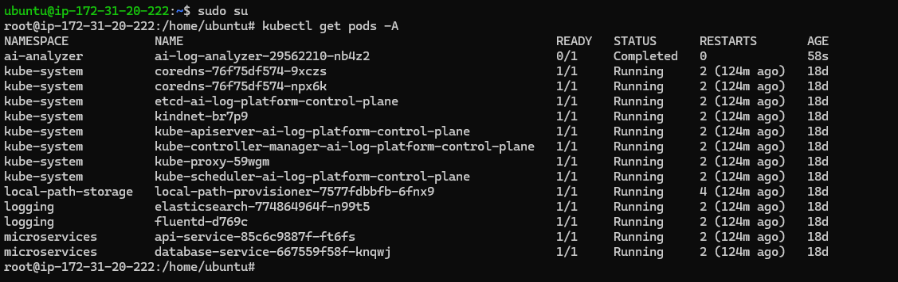
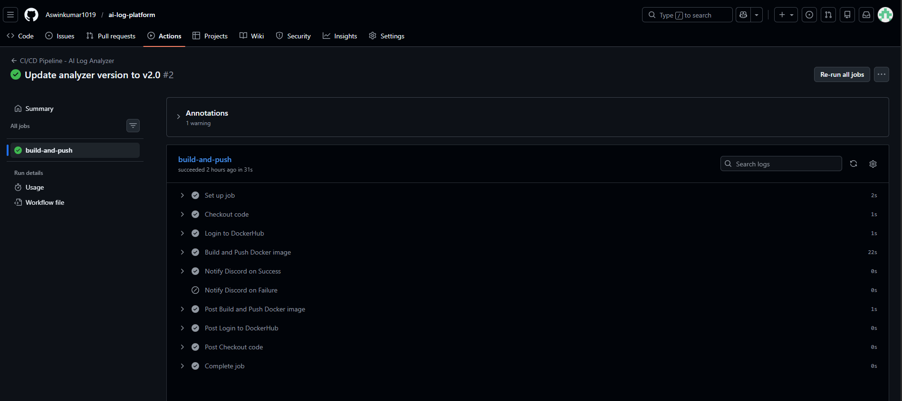
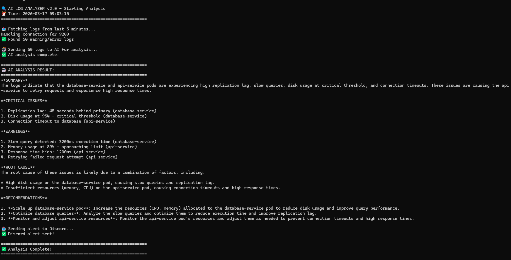
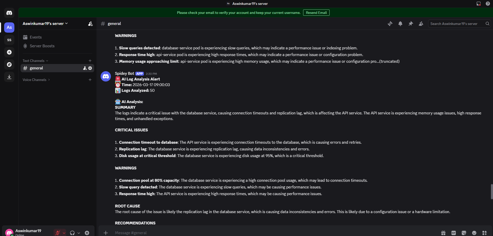
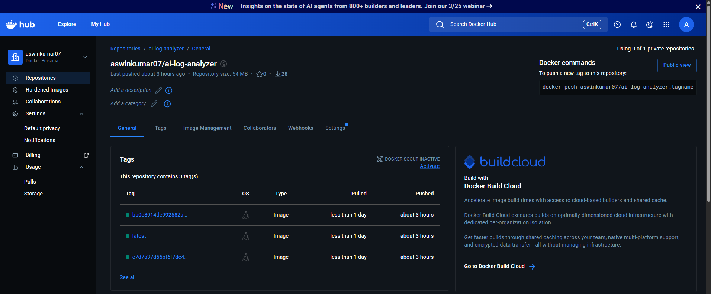

# AI-Powered Log Analysis Platform on Kubernetes

This project is an end-to-end implementation of a log analysis system built on Kubernetes. It collects logs from services, analyzes them using a language model, and sends structured alerts.

---

## Architecture

The system runs on a Kubernetes cluster and follows this flow:

- Services generate logs
- Fluentd collects logs from nodes
- Elasticsearch stores and indexes logs
- A CronJob runs analysis every 5 minutes
- Logs are sent to Groq AI
- A structured report is generated
- Alerts are delivered to Discord

### Architecture Flow

---

## CI/CD Pipeline

Every push to the main branch triggers an automated pipeline.

- Builds Docker image
- Pushes image to DockerHub
- Sends notification

### Pipeline Execution

---

## Log Processing

Logs are collected and stored centrally using the EFK stack.

- Fluentd collects logs from containers
- Elasticsearch indexes logs for querying

### Elasticsearch Output

---

## AI Analysis and Alerting

The analyzer fetches logs and sends them to the Groq API.  
A structured report is generated and pushed to Discord.

### Alert Output

---

## Container Registry

Docker images are built and stored with version tags.

### DockerHub Repository

---

## Project Structure

ai-log-platform/
├── .github/workflows/
├── k8s/
├── ai-analyzer/
├── docs/
└── restore.sh

---

## Setup

Clone the repository:

git clone https://github.com/Aswinkumar1019/ai-log-platform.git

cd ai-log-platform

Create environment file:

cp ai-analyzer/.env.example ai-analyzer/.env

Run setup:

bash restore.sh

---

## Key Challenges

- Disk space limitations on EC2
- cgroup configuration issues with Kubernetes
- Fluentd crashes due to incorrect probes
- Elasticsearch TLS incompatibility
- DNS resolution issues inside cluster
- API key exposure and cleanup

---

## What I Learned

- Kubernetes workloads and scheduling
- Logging architecture using EFK stack
- CI/CD automation using GitHub Actions
- Secrets management
- Debugging real infrastructure issues
- Integrating AI into DevOps workflows

---

## Author

Aswin Kumar

GitHub: https://github.com/Aswinkumar1019  
DockerHub: https://hub.docker.com/r/aswinkumar07/ai-log-analyzer  

---

## License

MIT License
